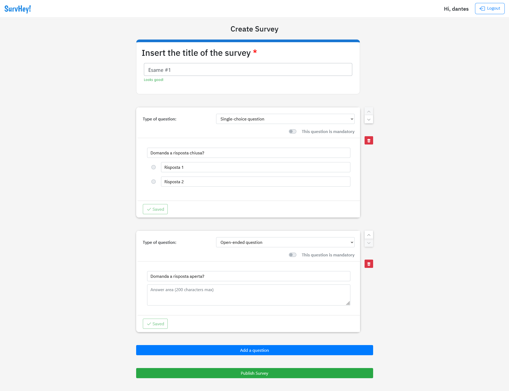

# Exam #1: "SURVEY"

## Student: s281660 MARINO DIEGO

## React Client Application Routes

- Route `/`: Home page.

  Here the user will find the list of available surveys ready to be filled out. In case an admin is logged in, this route redirects to `/admin/mySurveys`.

- Route `/login`: Login page.

  Here the user will be able to enter his admin credentials in the login form and log into the website. In case an admin is already logged in, this route redirects to `/admin/mySurveys`.

- Route `/survey/:id`: Survey page.

  Here the user can fill out the survey and send his submission. In case an admin is logged in, this route redirects to `/admin/mySurveys`.

  The `:id` param is the surveyId `integer` saved inside the database.

- Route `/admin/mySurveys`: Admin dashboard.

  This is the landing page after the login. Here, an admin can view his own surveys and related submissions. There's also a button to create a new survey. In case a unauthorized user tries to access this page, he is redirected to `/login`.

- Route `/admin/create`: Create a new survey page.

  After clicking the "Create Survey" button in the dashboard, the user lands here, where he can create a new survey, adding questions and whatever else is needed.
  In case a unauthorized user tries to access this page, he is redirected to `/login`.

## API Server

### **LOGIN**

URL: `/api/sessions`

Method: POST

Description: Login
Request body: An JSON object representing the user credentials `(Content-Type: application/json)`.

```
{
    "username": admin;
    "password": admin;
}
```

Response: `401 Unauthorized` (user not authenticated), `200 OK` (user authenticated).

Response body:

```
{
    "adminId": "1",
    "username": "admin",
}
```

### **LOGOUT**

URL: `/api/sessions/current`

Method: DELETE

Description: Logout

Request body: _None_

Response: _None_

Response body: _None_

### **GET USER INFO**

URL: `api/sessions/current`

Method: GET

Description: Get information about the user: `adminId, username`.

Request body: _None_

Response: `200 OK` (success), `401 Unauthorized` (fail).

Response body: A JSON object.

```
{
    "adminId": 1,
    "username": "admin"
}
```

### **LIST ALL SURVEYS**

URL: `/api/surveys`

Method: GET

Description: Get all surveys.

Request body: _None_

Response: `200 OK` (success) or `500 Internal Server Error` (generic error).

Response body: An array of JSON objects, each describing a survey.

```
[ {
        "surveyId": 6,
        "title": "Never gonna give you up",
        "adminId": 2
    },
    {
        "surveyId": 20,
        "title": "Let's sing! Cartoon Edition",
        "adminId": 1
    },
...
]
```

### **GET SURVEY by ID**

URL: `/api/surveys/:id`

Method: GET

Description: Get a survey identified by its id.

Params: `:id -> integer` contained in the db (`surveyId`).

Request body: _None_

Response: `200 OK` (success), `404 Not Found` (survey not found) or `500 Internal Server Error` (generic error).

Response body: An JSON object, describing a survey.

Response `200 OK`:

```
{
    "surveyId": 21,
    "title": "Italiani e il cibo",
    "adminId": 2,
    "questions": [
        {
            "questionId": 32,
            "questionText": "Quale è la pasta più buona? E perchè proprio la carbonara?",
            "min": 0,
            "max": 0,
            "pos": 0,
            "surveyId": "21",
            "answers": [
                {
                    "answerId": 59,
                    "pos": 0,
                    "answerText": "",
                    "questionId": 32,
                    "surveyId": 21
                }, ...
            ]
        }, ...
      ]
}
```

Response `404 Not Found`:

```
{
    "error": "SURVEY not found."
}
```

### **CREATE A NEW SURVEY**

URL: `/api/surveys`

Method: POST

Description: Create a new survey.

Request body: A JSON object representing the new survey `(Content-Type: application/json)`.

```
{
   "title":"Usability Testing: bespoke.com",
   "adminId":1,
   "questions":[
      {
         "key":"4f445a32-a2f0-47ff-980a-bb9544b845ca",
         "pos":0,
         "min":1,
         "max":1,
         "text":"How old are you?",
         "answers":[
            {
               "key":"26cce116-4d6a-4adc-80bb-b52236ecc798",
               "id":0,
               "text":"18-26"
            }, ...
         ],
         "isSaved":true
      },
      {
         "key":"d082479d-9336-4b19-ac1c-c50863779df7",
         "pos":1,
         "min":1,
         "max":1,
         "text":"What’s your highest level of education?",
         "answers":[
           ...
         ],
         "isSaved":true
      }, ...
   ]
}
```

Response: `201 Created` (success), `503 Service Unavailable` (generic error). If the request body is not valid, `422 Unprocessable Entity` (validation error).

Response body: _None_

### **LIST ALL SUBMISSIONS**

URL: `/api/submissions`

Method: GET

Description: Get all submissions.

Request body: _None_

Response: `200 OK` (success) or `500 Internal Server Error` (generic error).

Response body: An array of JSON objects, each describing a submission.

```
[
    {
        "user": "Pablo",
        "surveyId": 20,
        "answers": [
            {
                "answerText": "Maledetti Scarafaggi - Giorgio Vanni",
                "answerId": -1,
                "questionId": 28
            }, ...
        ]
    }, ...
]
```

### **CREATE A NEW SUBMISSION**

URL: `/api/submissions`

Method: POST

Description: Create a new submission.

Request body: A JSON object representing the new submission `(Content-Type: application/json)`.

```
{
   "submissionId":0,
   "user":"Nielsen",
   "answers":[
      {
         "text":"",
         "answerId":87,
         "questionId":37
      }, ...
   ],
   "surveyId":24
}
```

Response: `201 Created` (success), `503 Service Unavailable` (generic error). If the request body is not valid, `422 Unprocessable Entity` (validation error).

Response body: _None_

## Database Tables

- Table `admins (adminId, username, password)` - contains login credentials (username and hashed password) for the admins.
- Table `surveys (surveyId, title, adminId)` - contains the survey title and the id of the admin who created it.
- Table `questions (questionId, questionText, min, max, pos, surveyId)` - contains the question text and its properties: min, max, position in the survey, plus a reference to the survey it belongs to.
- Table `answers (answerId, answerText, pos, questionId, surveyId)` - contains the answer text and its position in the question, plus a reference to the survey and question it belongs to.
- Table `submissions (submissionId, user, answerText, answerId, questionId, surveyId)` - contains the submission sent by a user and his answers. In case it is an open-ended answer, the answer text is contained in the `answerText` column, while the `answerId` column has a default value of `-1`.
  If it is a close-ended answer, the selected answer ID is contained in the `answerId` column, while the `answerText` column is empty.

## Main React Components

- `Survey` (in `Survey.js`): It provides the skeleton for displaying the survey to the user. It initializes the survey with the correct type of cards for each question.
- `CloseEndedQuestion` (in `CloseEndedQuestion.js`): Card for close-ended questions.
- `OpenEndedQuestion` (in `OpenEndedQuestion.js`): Card for open-ended questions.
- `SurveyTemplate` (in `SurveyTemplate.js`): It provides the skeleton for creating the survey to the admin. It manages the addition of new questions and the publishing of a new survey.
- `QuestionTemplate` (in `QuestionTemplate.js`): Provides the skeleton for configuring a question during the creation of a new survey. It manages the deletion and the reordering of a question; it also validates and save each question.
- `CloseEndedTemplate` (in `CloseEndedTemplate.js`): Card for close-ended questions, used during the creation of a new survey.
- `OpenEndedTemplate` (in `OpenEndedTemplate.js`): Card for open-ended questions, used during the creation of a new survey.
- `AdminDashboard` (in `AdminDashboard.js`): Dashboard component for the admin home page. It displays an admin's surveys and the related submissions.

## Screenshot



## Users Credentials

| Username | Password    | Surveys |
| :------- | :---------- | :------ |
| johnwick | continental |         |
| dantes   | montecristo |         |
